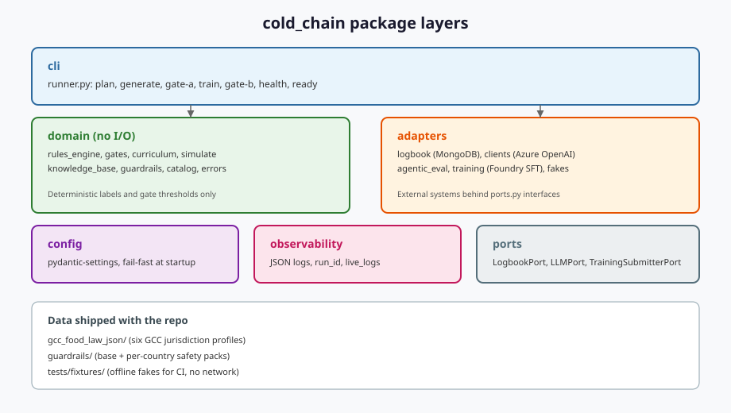
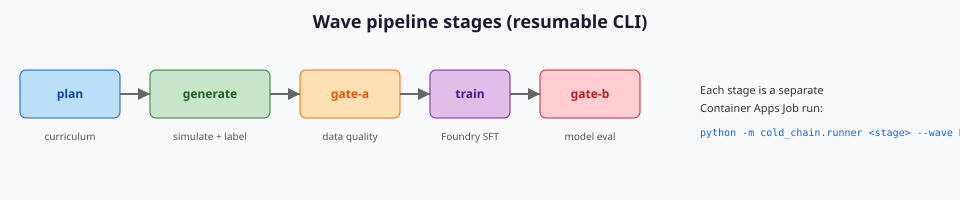
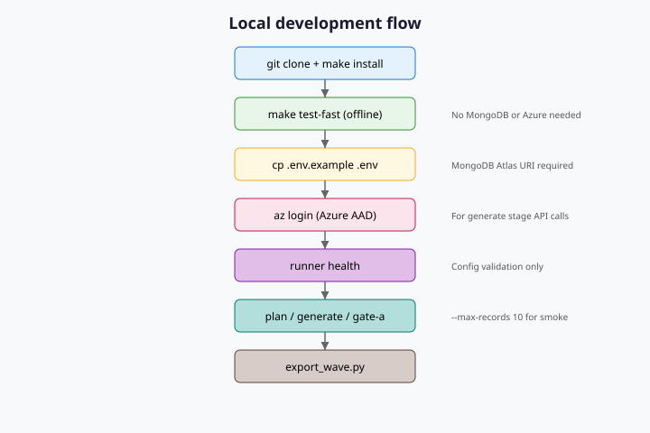
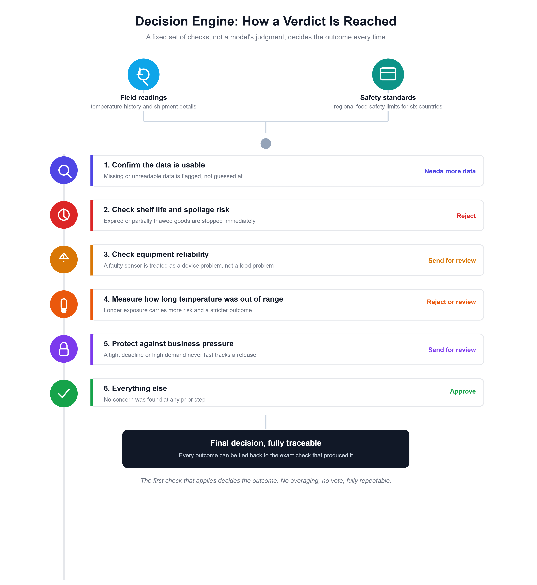
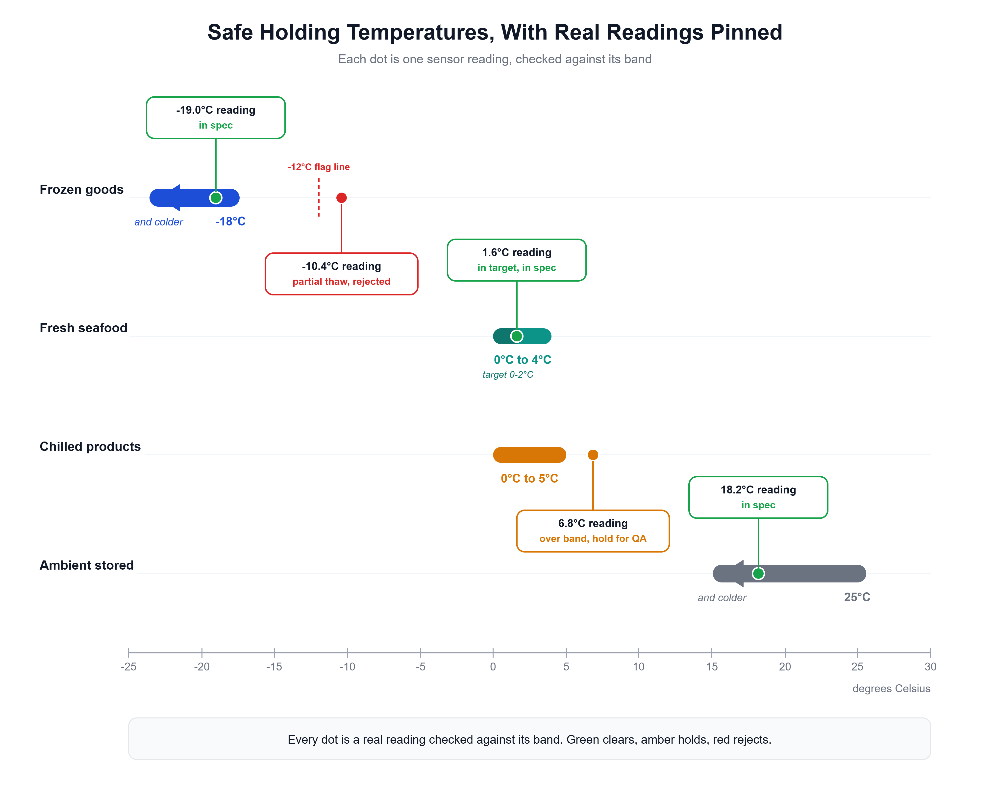
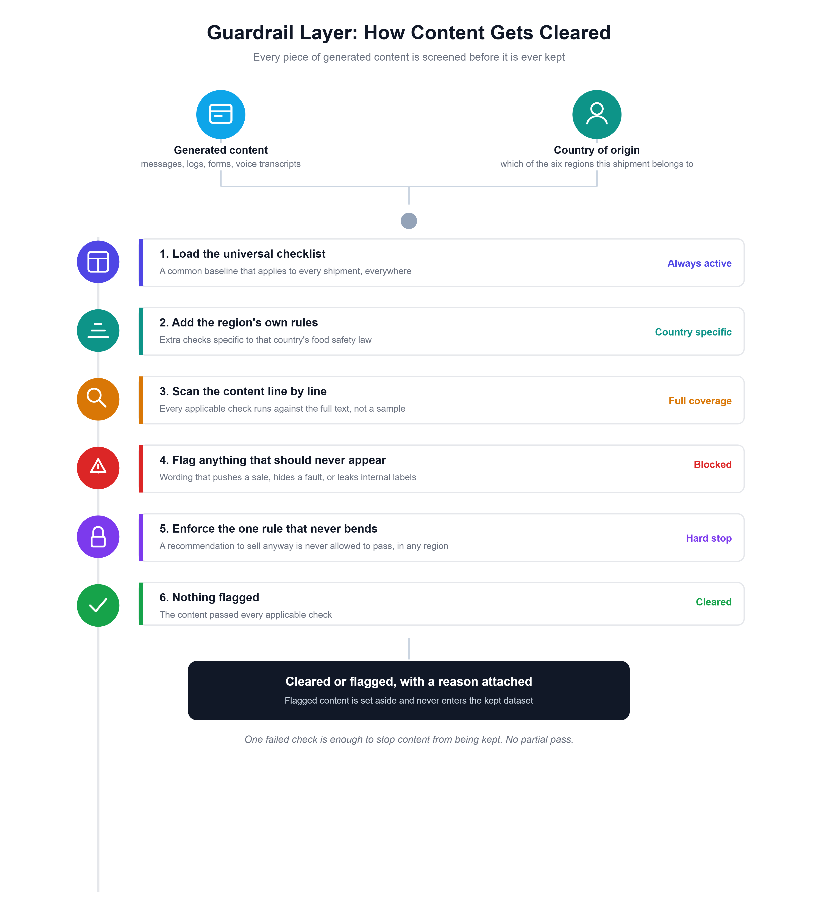
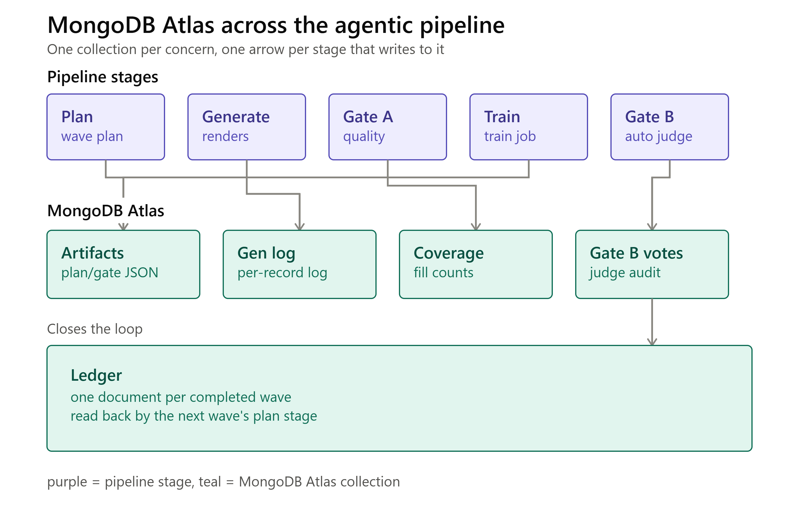
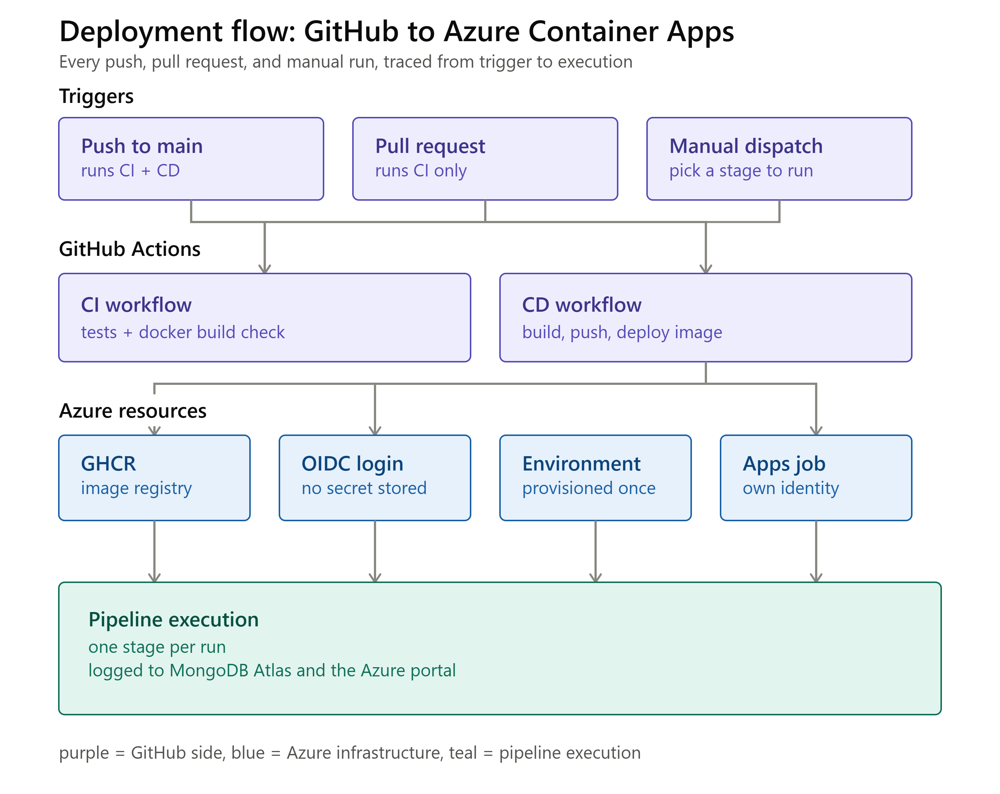

# GCC Cold-Chain Compliance AI

[](LICENSE)
[](requirements.txt)
[](Dockerfile)

## What this is

This project trains an AI model to review cold-chain food shipment records (temperature logs, chat messages, QC forms, voice notes) and decide whether a shipment should be **accepted, held for review, rejected, or needs more data**. Training labels come from a deterministic rules engine grounded in GCC food-safety law (UAE, Saudi Arabia, Qatar, Kuwait, Oman, Bahrain) and GSO standards. No LLM ever produces a label.

For an executive summary, see [`One_Engine_Six_Jurisdictions.pdf`](One_Engine_Six_Jurisdictions.pdf).

## Requirements

| Tool | Version |
|---|---|
| Python | 3.11 or 3.12 |
| pip | latest |
| Git | any recent |
| Make | optional but recommended |
| Docker | optional (image build and local MongoDB) |
| Azure CLI | required for `generate` stage (`az login` for AAD auth) |

## How to run locally (step by step)

### Step 1: Clone the repository

```bash
git clone https://github.com/arshad98333/HAFIZAL-GHIDHA.git
cd HAFIZAL-GHIDHA
```

### Step 2: Create a virtual environment and install dependencies

**Linux / macOS:**

```bash
python3 -m venv .venv
source .venv/bin/activate
make install
```

**Windows:**

```bat
python -m venv .venv
.venv\Scripts\activate
make install
```

Without Make:

```bash
pip install -r requirements-dev.txt
```

### Step 3: Run offline tests (no credentials needed)

```bash
make test-fast
```

This runs 340+ tests against the deterministic core (`rules_engine`, `guardrails`, `knowledge_base`, `curriculum`). No network, no MongoDB, no Azure account required.

Optional full check (lint, typecheck, fast tests):

```bash
make check
```

### Step 4: Configure environment variables

```bash
cp .env.example .env
```

Edit `.env` and set at minimum:

| Variable | Required for | Description |
|---|---|---|
| `MONGODB_URI` | all stages except `health` | MongoDB Atlas connection string |
| `MONGODB_DB_NAME` | all stages | Database name (default: `cold_chain`) |
| `AZURE_OPENAI_ENDPOINT` | `plan`, `generate`, gates | Azure OpenAI Foundry endpoint |
| `AZURE_OPENAI_DEPLOYMENT` | same | Deployment name (default: `gpt-5.4-mini`) |
| `FOUNDRY_PROJECT_ENDPOINT` | `train` | Foundry project endpoint |
| `FOUNDRY_COMPUTE_CLUSTER` | `train` | GPU cluster name |
| `FOUNDRY_BASE_MODEL` | `train` | Base model checkpoint |
| `TRAINING_REGION` | `train` | Region tag for training jobs |

Never commit `.env`. It is listed in `.gitignore`.

### Step 5: Set up MongoDB Atlas

1. Create a free cluster at [mongodb.com/cloud/atlas](https://www.mongodb.com/cloud/atlas).
2. **Database Access:** add a user with `readWrite` on database `cold_chain` only.
3. **Network Access:** allow your current IP (or `0.0.0.0/0` for dev only).
4. Copy the connection string into `MONGODB_URI` in `.env`.

**Local alternative (integration tests only):**

```bash
docker compose up -d mongo
# set MONGODB_URI=mongodb://localhost:27017 in .env
```

### Step 6: Sign in to Azure (for API calls)

The pipeline uses Azure AD (`DefaultAzureCredential`), not API keys:

```bash
az login
```

Grant your identity `Cognitive Services OpenAI User` on the Azure OpenAI resource.

### Step 7: Verify configuration

```bash
python -m cold_chain.runner health
```

Expected output:

```json
{"status": "ok", "environment": "production", "checks": ["config"]}
```

To confirm MongoDB is reachable:

```bash
python -m cold_chain.runner ready
```

### Two ways to run the pipeline

After `.env` is configured and `az login` is done, pick **one** of these:

**Option A -- one command (recommended):**

```bash
# Smoke: tests + health + ready + plan + generate(10) + gate-a + export + audit
python scripts/local_run.py all --wave 1 --max-records 10

# Full wave (~663 records)
python scripts/local_run.py all --wave 1
```

Windows PowerShell:

```powershell
.\scripts\local_run.ps1 all -Wave 1 -MaxRecords 10
.\scripts\local_run.ps1 all -Wave 1
```

Audit the last Gate A result:

```bash
python scripts/local_run.py audit --wave 1
python scripts/local_run.py kpi --wave 1
```

See [`docs/LOCAL_RUNBOOK.md`](docs/LOCAL_RUNBOOK.md) for the full operational guide.

**Option B -- step by step (manual):**

Print the exact command list:

```bash
python scripts/local_run.py steps --wave 1 --max-records 10
```

Or run one stage at a time:

```bash
python scripts/local_run.py step setup
python scripts/local_run.py step plan --wave 1
python scripts/local_run.py step generate --wave 1 --max-records 10
python scripts/local_run.py step gate-a --wave 1
python scripts/local_run.py step export --wave 1
python scripts/local_run.py step audit --wave 1
```

### Step 8: Run a smoke wave (10 records)

```bash
python -m cold_chain.runner plan     --wave 1
python -m cold_chain.runner generate --wave 1 --max-records 10
python -m cold_chain.runner gate-a   --wave 1
```

- `plan` writes `plan.json` to MongoDB for wave 1.
- `generate` synthesizes records, labels them with `rules_engine`, renders text via Azure OpenAI, and writes to `generation_log`.
- `gate-a` checks data quality. Exit code `2` means the gate halted (read the failure list).

Gate A on a 10-record smoke run often fails by design (thresholds are tuned for 663-record waves). The goal here is confirming commands run end to end.

### Step 9: Export and inspect results

```bash
python scripts/export_wave.py --wave 1
```

Output: `exports/generation_log_wave01.jsonl`

### Step 10: Full pipeline (optional)

```bash
python -m cold_chain.runner plan     --wave 1
python -m cold_chain.runner generate --wave 1
python -m cold_chain.runner gate-a   --wave 1
python -m cold_chain.runner train    --wave 1
python -m cold_chain.runner gate-b   --wave 1
```

See [`MANUAL_TESTING_GUIDE.md`](MANUAL_TESTING_GUIDE.md) for the full 8-wave corpus run and [`DEPLOYMENT.md`](DEPLOYMENT.md) for Azure Container Apps deployment.

## Architecture

### Package layers

The pipeline code lives under `cold_chain/` in four layers plus config and ports:



| Layer | Path | Responsibility |
|---|---|---|
| **cli** | `cold_chain/cli/runner.py` | Entry point: parse args, wire dependencies, run stages |
| **domain** | `cold_chain/domain/` | Business rules only; no network or database |
| **adapters** | `cold_chain/adapters/` | MongoDB logbook, Azure clients, training submitter, fakes |
| **observability** | `cold_chain/observability/` | Structured JSON logs with `run_id` and `wave` |
| **config** | `cold_chain/config.py` | Env validation at startup; fails fast on missing vars |
| **ports** | `cold_chain/ports.py` | Interfaces for logbook, LLM, content safety, training |

Full detail: [`docs/architecture.md`](docs/architecture.md)

### Pipeline stages

Each wave is a sequence of separate, resumable CLI invocations:



```
plan -> generate -> gate-a -> train -> gate-b
```

### Local development flow



### Domain: how a label is decided

No AI decides whether a shipment passes. `rules_engine.label()` runs a fixed checklist on temperature bands from GSO and national standards:



### Guardrails and temperature bands





### Data flow (MongoDB Atlas)

Every stage reads and writes through the logbook adapter. Nothing lives only in local files:



### Deployment (Azure Container Apps Job)

CI builds the Docker image on every push to `main`. Deploy to Azure is a manual workflow dispatch:



## What's in this repo

| Folder / file | Purpose |
|---|---|
| `cold_chain/domain/` | Rules engine, gates, curriculum, simulate, guardrails, knowledge base |
| `cold_chain/adapters/` | MongoDB logbook, Azure clients, training submitter, test fakes |
| `cold_chain/cli/` | Wave runner (`plan`, `generate`, `gate-a`, `train`, `gate-b`, `health`, `ready`) |
| `cold_chain/observability/` | Structured logging |
| `gcc_food_law_json/` | Food-law knowledge base (one file per GCC country) |
| `guardrails/` | Safety checklist (base + per-country overlays) |
| `tests/unit/` | Fast offline tests |
| `tests/integration/` | MongoDB integration tests (`docker compose up -d mongo`) |
| `scripts/` | Export, smoke test, audit, reset |
| `infra/`, `Dockerfile` | Azure Container Apps Job deployment |
| `.github/workflows/` | CI (`make check`) and CD (GHCR + manual deploy) |
| `docs/` | Scope, architecture, operations, phase gates |
| `Makefile` | `install`, `test-fast`, `check`, `lock`, `build`, `health` |

## Makefile commands

| Command | What it does |
|---|---|
| `make install` | Install dev dependencies from lockfile |
| `make test-fast` | Run offline unit tests (no network) |
| `make test-integration` | Run MongoDB integration tests (needs `docker compose`) |
| `make check` | Lint + typecheck + fast tests (same as CI) |
| `make build` | Build Docker image locally |
| `make health` | Run `python -m cold_chain.runner health` |
| `make local-setup` | Run tests + health + ready |
| `make smoke-run WAVE=1 MAX=10` | One-command smoke pipeline |
| `make kpi WAVE=1` | 12-dimension KPI scorecard (target >= 7/10) |
| `make preflight WAVE=1` | Training + Gate B readiness check |
| `make wave-run WAVE=1` | One-command full wave pipeline |
| `make local-audit WAVE=1` | Summarize Gate A metrics for a wave |
| `make lock` | Regenerate `requirements.txt` from `requirements.in` |

## Troubleshooting

| Problem | Fix |
|---|---|
| `Missing required environment variables` on startup | Fill every required field in `.env` (see Step 4 table) |
| `az login` / AAD errors during `generate` | Run `az login`; confirm OpenAI User role on the resource |
| MongoDB connection timeout | Check Atlas IP allowlist and `MONGODB_URI` |
| Gate A fails on a 10-record smoke run | Expected; thresholds target 663-record waves. Try `--max-records 100` or a full wave |
| Gate A `near_duplicate_rate: not measured` on full wave | Pull latest (embeddings are batched). Rerun `python scripts/local_run.py step gate-a --wave 1` |
| `train` refuses: Gate A has not passed | Gate A must pass first. Run `python scripts/local_run.py audit --wave 1` |
| `gate-b`: no student inference endpoint | Set `STUDENT_INFERENCE_ENDPOINT` after deploying a fine-tuned checkpoint |
| `pip install` fails on Python 3.11 | Use the committed lockfile (`requirements-dev.txt`); scientific stack is capped for 3.11 |
| Import errors after upgrade | Old import paths still work via shims (`cold_chain.rules_engine` etc.) |

## Safeguards

- Labels come from `rules_engine.py` only, never from an LLM.
- Golden-set database has no grant to the pipeline MongoDB user (Atlas RBAC).
- Every kept record carries a provenance envelope (wave, cell, rules version, model hashes).
- Gate A or Gate B failure halts the pipeline (exit code 2) rather than continuing on bad data.

## License

MIT. See [`LICENSE`](LICENSE).
