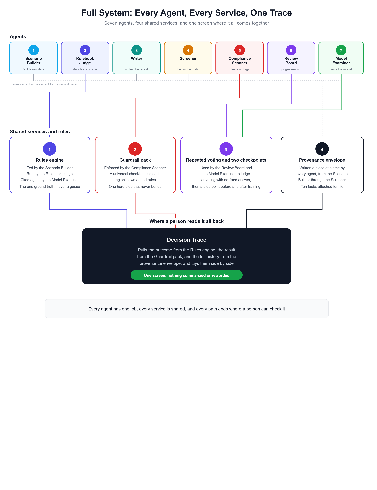

# GCC Cold-Chain Compliance AI

## What this is

This project trains an AI model to check food shipment records — temperature logs, chat messages, QC forms, voice notes — and decide whether a shipment should be **accepted, held for review, rejected, or needs more data**. The decisions the AI is trained on aren't guesses: they come from a fixed rule engine built on the actual food safety laws of six Gulf countries (UAE, Saudi Arabia, Qatar, Kuwait, Oman, Bahrain), including GSO (Gulf Standardization Organization) standards.

In short: real food-safety rules, turned into training data, so an AI can learn to make the same call a compliance officer would.

## How it works

**The full picture.** Seven specialized steps generate a shipment record, check it against the rules, and write everything to one traceable log a person can read back at any time.

**How a decision gets made.** No AI judgment call decides whether a shipment passes — a fixed checklist does, in order, every time.

**Safety limits, in practice.** Every temperature reading is checked against the safe range for that product type — frozen, fresh, chilled, or ambient — under GSO and national standards.

**Content screening.** Before any generated record is kept, it's checked against a universal safety checklist plus each country's own added rules. One rule never bends: nothing that pressures a sale over a safety concern is ever allowed through.

**Where the data lives.** Every stage of the pipeline reads from and writes to MongoDB Atlas, so nothing is only in local files, and each finished batch is logged before the next one starts.

**Getting it live.** Pushing to the main branch tests the code, builds it, and deploys it to Azure automatically — no manual steps, no stored passwords.

## What's in this repo

| Folder / file | What it's for |
|---|---|
| `cold_chain/` | The core pipeline code |
| `gcc_food_law_json/` | The food-law knowledge base — one file per country, each citing its source |
| `guardrails/` | The safety checklist described above |
| `scripts/` | Tools to test, export, and audit results |
| `infra/`, `Dockerfile` | Everything needed to deploy this to Azure |
| `.github/workflows/` | Automated testing and deployment on every code push |
| [`DEPLOYMENT.md`](DEPLOYMENT.md) | Full deployment setup guide |
| [`ROADMAP.md`](ROADMAP.md) | What's built, what's next |
| [`CONTRIBUTING.md`](CONTRIBUTING.md) | How to contribute |
| [`MANUAL_TESTING_GUIDE.md`](MANUAL_TESTING_GUIDE.md) | Step-by-step commands to set up and run a full batch, for engineers |
| [`LICENSE`](LICENSE) | MIT |

## Getting started (for engineers)

Full setup — Python environment, database, credentials, and running a batch end to end — is in [`MANUAL_TESTING_GUIDE.md`](MANUAL_TESTING_GUIDE.md). Deployment to Azure is covered in [`DEPLOYMENT.md`](DEPLOYMENT.md).

## The safeguards, in plain terms

No AI model ever decides a label directly — a fixed set of rules does, and that logic is open to review. The verified reference data used for training is kept completely separate from anything an AI agent can touch during testing, so results can't be gamed. Every kept record carries a full paper trail: what created it, what model touched it, and which country's rules applied. And if any safety check fails partway through a batch, the whole batch stops rather than continuing on bad data.

## License

MIT — see [`LICENSE`](LICENSE).
