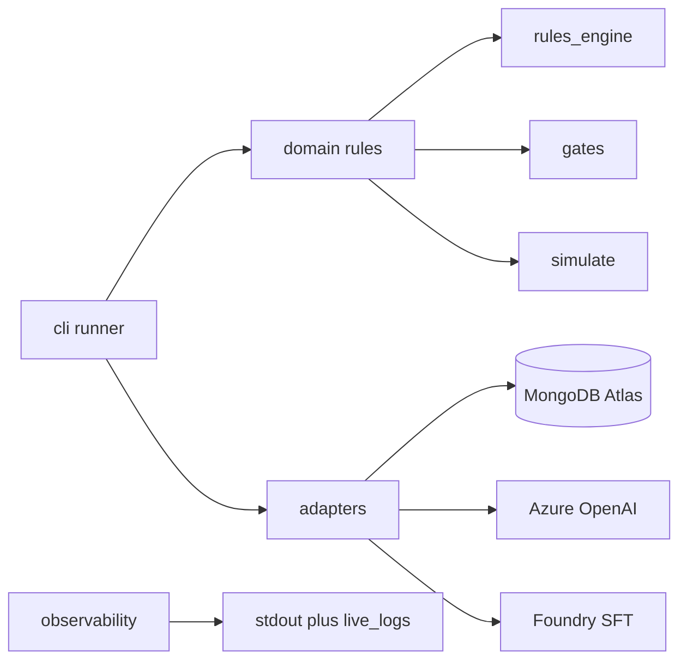

# Architecture

## System shape

This is a **batch CLI pipeline** deployed as an **Azure Container Apps Job**. There is no long-running HTTP server. Each stage is a separate, resumable invocation:

```
plan → generate → gate-a → train → gate-b
```



## Layer responsibilities

| Layer | Modules | Rule |
|---|---|---|
| **config** | `cold_chain/config.py` | Load and validate env once at startup |
| **domain** | `rules_engine`, `gates`, `curriculum`, `knowledge_base`, `guardrails`, `simulate` | Business rules; no network or database |
| **adapters** | `logbook`, `clients`, training submitter | Implement ports; translate library errors |
| **cli** | `runner` | Parse args, wire dependencies, run stages |
| **observability** | `telemetry` | Structured logs, correlation ids |
| **ports** | `cold_chain/ports.py` | Interfaces for logbook, LLM, content safety, training |

## Request / job flow (generate stage)

1. CLI loads `Settings` and opens `Logbook` adapter.
2. Reads `plan.json` from wave artifacts (written by `plan` stage).
3. For each allocation cell: `simulate` builds `WorldState` → `rules_engine.label` assigns disposition.
4. `AzureClient` renders artifact text (disposition stripped from prompt).
5. Content safety screen (optional) → guardrail check.
6. Records written to `generation_log`; coverage updated.
7. Gate A evaluates aggregate metrics; may halt pipeline.

## Data stores

MongoDB collections (default database `cold_chain`): `ledger`, `coverage_state`, `generation_log`, `wave_artifacts`, `decisions`, `live_logs` (30d TTL). Golden set lives in a **separate database** with no grant to the pipeline user.

## Deployment

- **Image:** `Dockerfile` → GHCR via CD workflow.
- **Runtime:** ACA Job with system-assigned managed identity for Azure OpenAI (AAD).
- **Secrets:** Mongo URI via env / Key Vault reference (Phase 3).
